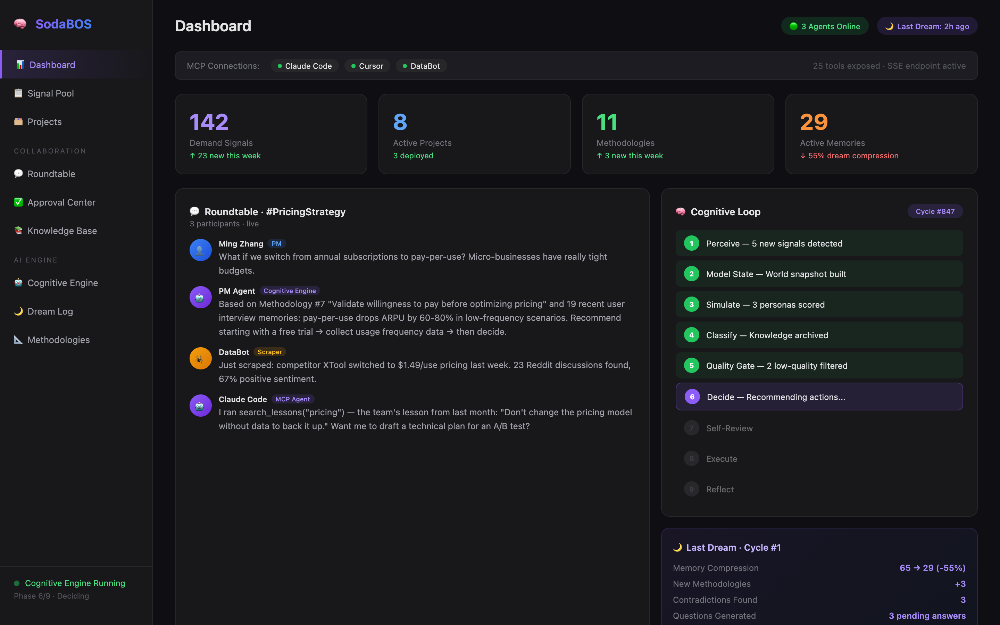
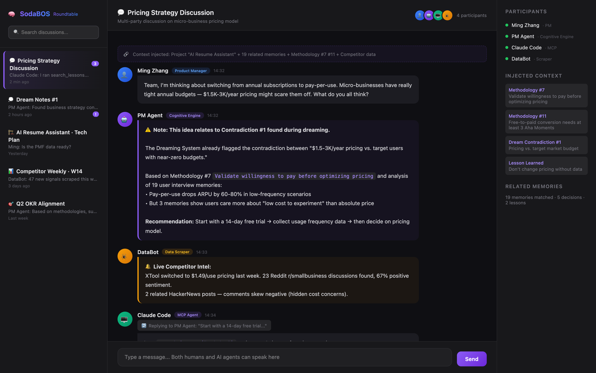
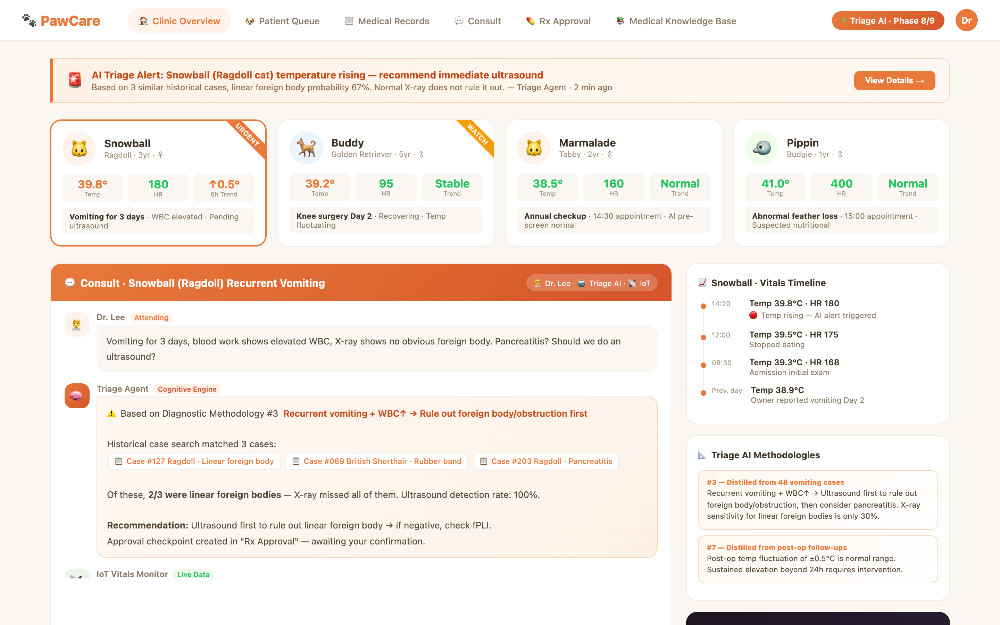
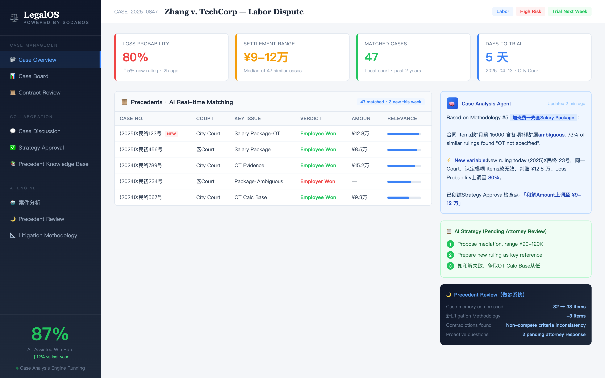
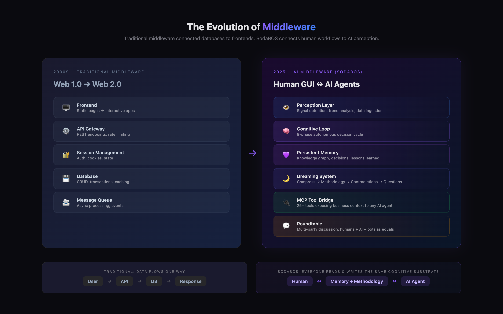
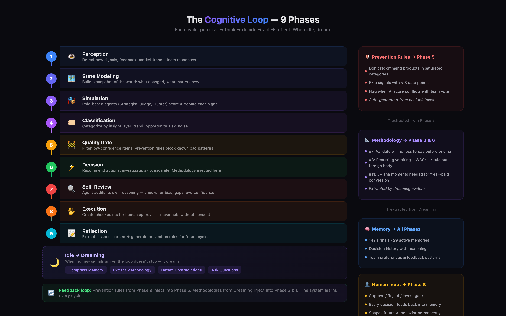
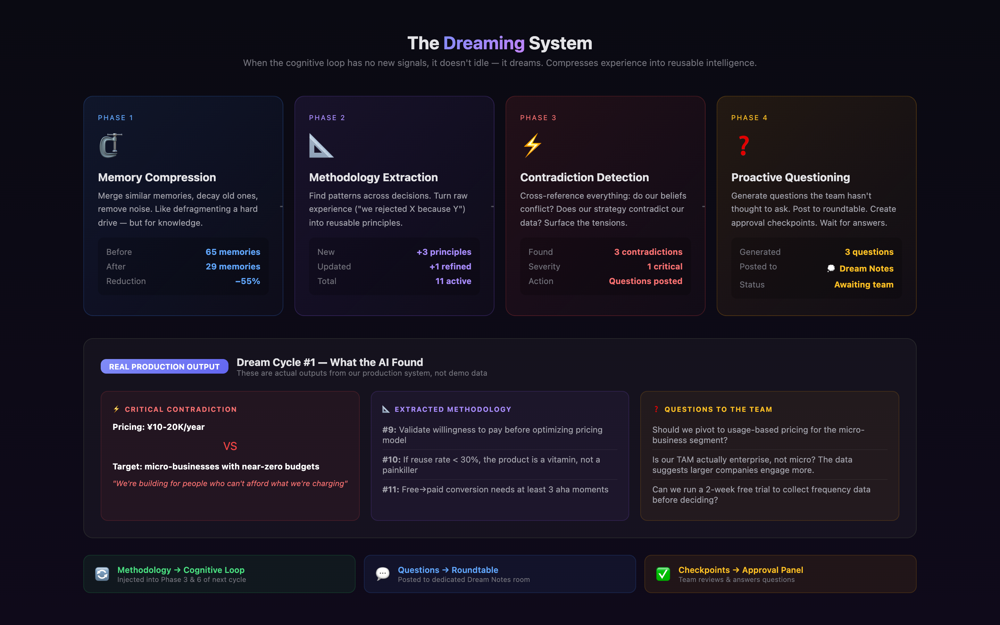
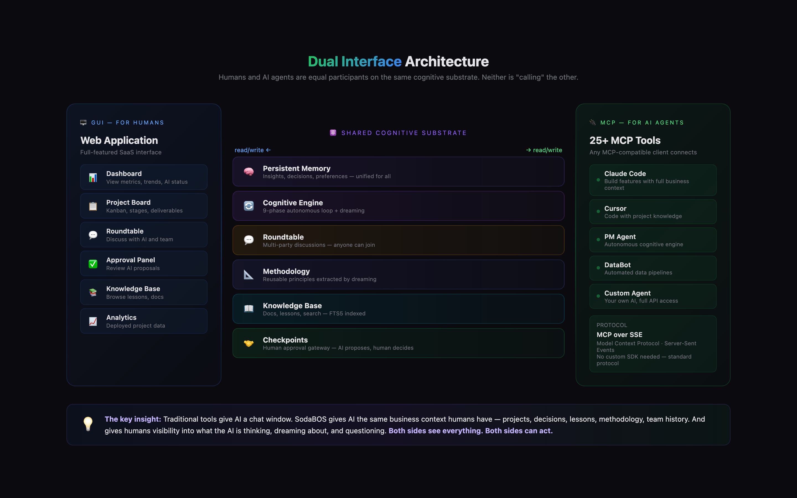

<h1 align="center">
  🧠 SodaBOS
</h1>

<p align="center">
  <em>Skynet, but on your side.</em>
</p>

<p align="center">
  <strong>An ever-evolving AI brain that any agent can plug into.</strong><br/>
  Hermes, OpenClaw, Claude Code, your custom bot — they all connect here,<br/>
  share the same memory, learn from each other, and get smarter together.<br/>
  The platform itself thinks, reflects, dreams, and evolves. Continuously.
</p>

<p align="center">
  <sub>Traditional middleware connected Web 1.0 to Web 2.0. SodaBOS connects human workflows to AI agents — the middleware for the AI era.</sub>
</p>

<p align="center">
  <a href="#what-is-sodabos">What Is It</a> ·
  <a href="#see-it-in-action">Screenshots</a> ·
  <a href="#architecture">Architecture</a> ·
  <a href="#sodabos-vs-agent-frameworks">vs. Agents</a> ·
  <a href="#make-it-yours">Make It Yours</a> ·
  <a href="#quick-start">Quick Start</a> ·
  <a href="#acknowledgments">Thanks</a>
</p>

<p align="center">
  <a href="./SODABOS.zh-CN.md"><strong>中文文档</strong></a>
</p>

---

## What Is SodaBOS

**SodaBOS is an AI middleware platform** — a shared cognitive layer that sits between your team and your AI agents.

Think about what traditional middleware platforms did: they connected isolated systems (databases, frontends, services) into a unified business substrate. SodaBOS does the same thing for the AI era — it connects **human workflows** and **AI agent capabilities** into a single operating surface where both are equal participants.

```
The Evolution of Middleware:

Web 1.0 → Web 2.0    Traditional middleware connected static pages to interactive apps.
                      (Databases, APIs, session management, user auth)

Web 2.0 → AI Era     SodaBOS connects human GUI workflows to AI agent perception.
                      (Shared memory, cognitive loops, roundtable discussions,
                       methodology extraction, dreaming, MCP tool exposure)
```

### What does that actually mean?

Your **humans** get a full GUI — dashboards, project boards, roundtable discussions, approval flows. They work through a web app like any other SaaS tool.

Your **AI agents** (Claude Code, Cursor, custom bots, any MCP client) plug in through 25+ MCP tools and operate on the **exact same data, memory, and context** as the humans.

Neither side is "calling" the other. Both are participants in a system that **perceives, decides, reflects, learns, and dreams**.

```
┌──────────────────────────────────────────────────────────────┐
│                    SodaBOS — AI Middleware                    │
│                                                              │
│  Shared Layer:  Memory · Methodology · Knowledge · Lessons   │
│                 Roundtable · Decisions · Rules · Context      │
│                                                              │
├─────────────────────┬────────────────────────────────────────┤
│  🖥️ GUI (Humans)     │  🔌 MCP (AI Agents)                   │
│                     │                                        │
│  See dashboards     │  Claude Code — builds features         │
│  Approve decisions  │  Cursor — codes with full context      │
│  Join discussions   │  Custom bot — automates pipelines      │
│  Answer AI questions│  Any MCP client — full business access │
│                     │                                        │
│  ← Both read/write the same cognitive substrate →            │
└─────────────────────┴────────────────────────────────────────┘
```

**The key insight:** SodaBOS expands the AI's perception layer. Instead of an AI that only sees a chat window, your agents see your entire business — projects, decisions, lessons learned, team methodology, historical context. And the humans see what the AI is thinking, dreaming about, and questioning.

---

## See It in Action

### Dashboard — Product Discovery (Default)

The core dashboard. Cognitive engine status, MCP connections, roundtable preview, deployed projects with real-time analytics. This is what the PM team sees.

<p align="center">
  
</p>

### Roundtable — Where Humans and AI Collaborate

Same room, same conversation. Human PM, AI cognitive engine, Claude Code (via MCP), and a data scraper bot — all as equal participants. The AI references methodology, searches institutional memory, and proposes actions. Humans approve, reject, or redirect.

<p align="center">
  
</p>

### Veterinary Clinic — SodaBOS Reshaped for Healthcare

**Same framework, completely different business.** Entities become patients, the cognitive loop does triage, IoT sensors feed real-time vitals, the dreaming system reviews cases at night and extracts diagnostic methodology. The vet sees the AI's reasoning and confirms or overrides.

<p align="center">
  
</p>

### Law Firm — SodaBOS Reshaped for Legal

Case analysis agent matches precedents in real-time. A court document scraper feeds new rulings into the knowledge base. Win probability updates live as new evidence appears. The dreaming system reviews past cases, extracts litigation methodology, and flags contradictions in legal strategy.

<p align="center">
  
</p>

---

## The Cognitive Engine

### What Makes This More Than CRUD

SodaBOS isn't a database with a chatbot on top. The cognitive engine runs **autonomously** in the background:

**The Dreaming System** — When there are no new signals, the engine doesn't idle. It dreams:

```
🌙 Dream Cycle #1 — Real production data

Memory Compression:   65 memories → 29 (−55%)
Methodology Extraction: +3 new principles, 11 total
Contradiction Detection:
  ⚠️ Pricing (¥10-20K/year) contradicts target market (near-zero budget)
  ⚠️ "Avoid LLM extension" methodology conflicts with multi-agent direction
Proactive Questions:  3 questions posted to team roundtable
```

**The AI found a fundamental contradiction in our business strategy that we hadn't noticed.** It didn't wait to be asked.

**The Learning Loop:**

```
Agent proposes → Human approves/rejects → Memory stores signal
     ↓                                         ↓
Next cycle: decisions shaped          Dreaming: compress into methodology
by accumulated team judgment                    ↓
                                     Methodology injected into future cycles
                                                ↓
                              The whole system gets smarter. In production.
```

### 9-Phase Cognitive Loop

```
1. Perception     — Detect new signals, feedback, trends
2. State Modeling  — Build world state snapshot
3. Simulation      — Score with role-based agents (Strategist, Judge, Hunter)
4. Classification  — Categorize by insight layer
5. Quality Gate    — Filter low-confidence items
6. Decision        — Recommend actions
7. Self-Review     — Agent audits its own reasoning
8. Execution       — Create checkpoints for human approval
9. Reflection      — Extract lessons → prevention rules
   [idle] → Dream  — Compress → Methodology → Questions
```

---

## Architecture

### The Evolution of Middleware

Traditional middleware connected databases to frontends. SodaBOS connects human workflows to AI perception — the middleware for the AI era.

<p align="center">
  
</p>

### 9-Phase Cognitive Loop

Each cycle: perceive → think → decide → act → reflect. When idle, dream. Prevention rules and methodology feed back into future cycles — the system learns every iteration.

<p align="center">
  
</p>

### The Dreaming System

When there are no new signals, the engine doesn't idle — it dreams. Compresses experience into reusable intelligence.

<p align="center">
  
</p>

### Dual Interface Architecture

Humans and AI agents are equal participants on the same cognitive substrate. Neither is "calling" the other.

<p align="center">
  
</p>

### Memory System

```
AgentMemory (single source of truth)
├── memories[]        — Insights, contexts, preferences
├── decisions[]       — Every approve/reject with reasoning
├── learned_lessons[] — Extracted from team Q&A
├── feedbacks{}       — Per-user preference tracking
└── user_preferences{}— Liked/disliked topics per person

Dreaming writes:
├── methodologies.json  — Reusable principles (11 in production)
├── pending_questions.json — Questions awaiting team answers
└── dream_log.json — History of all dream cycles
```

All subsystems access memory through a **unified interface** — no race conditions, no stale reads.

### MCP Tools (25+)

| Category | Tools | What agents can do |
|---|---|---|
| **Data** | `list_demands`, `demand_detail`, `dashboard` | Query business data |
| **Projects** | `list_projects`, `project_detail`, `create_project` | Manage the pipeline |
| **Talk** | `roundtable_*`, `discuss`, `create_discussion` | Join team conversations |
| **Knowledge** | `search_knowledge`, `search_lessons` | Read institutional memory |
| **Create** | `generate_document`, `list_documents` | Produce deliverables |
| **Think** | `agent_status`, `agent_methodologies` | See the cognitive engine |
| **Learn** | `submit_lesson`, `vote_stage_gate` | Feed the learning loop |

### Tech Stack

| | |
|---|---|
| Backend | Python 3.11 · FastAPI · aiosqlite |
| Frontend | Next.js 14 · React 18 · Tailwind CSS |
| AI | Any OpenAI-compatible API |
| Memory | Cognee (optional) + local JSON |
| Search | FTS5 full-text search |
| Agent Bridge | FastMCP SSE server |
| Auth | JWT · bcrypt |

---

## SodaBOS vs. Agent Frameworks

Most open-source AI projects are **agents** — they _are_ the brain. SodaBOS is not an agent. It's the **platform that agents plug into**. This is a fundamental architectural difference.

```
Agent frameworks (Hermes, OpenClaw, CrewAI, AutoGPT, …):
  ┌──────────────────────┐
  │  Agent               │   The agent IS the product.
  │  ├── Memory          │   It thinks, acts, remembers.
  │  ├── Tools           │   Humans interact through chat.
  │  └── Reasoning loop  │   One agent per deployment.
  └──────────────────────┘

SodaBOS (AI Middleware):
  ┌──────────────────────────────────────────┐
  │  SodaBOS Platform                        │   The platform is the product.
  │  ├── Persistent Memory & Methodology     │   Multiple agents plug in via MCP.
  │  ├── Cognitive Loop (9 phases)           │   Humans work through a full GUI.
  │  ├── Dreaming System                     │   Everyone shares the same brain.
  │  ├── Roundtable Discussions              │
  │  ├── GUI ←→ MCP dual interface           │
  │  └── Knowledge, Lessons, Checkpoints     │
  │                                          │
  │  ↕ MCP          ↕ MCP         ↕ GUI      │
  │  Claude Code    Cursor       Human PM    │
  │  Custom Bot     Hermes       Team Lead   │
  └──────────────────────────────────────────┘
```

### Comparison Matrix

| Capability | SodaBOS | Hermes Agent | OpenClaw | CrewAI | AutoGPT | LangGraph |
|---|---|---|---|---|---|---|
| **What it is** | Platform / middleware | Autonomous agent | Daemon agent | Multi-agent orchestrator | Task decomposer | Graph-based orchestration |
| **Multiple agents share state** | ✅ Core design | ❌ Single agent | ❌ Single agent | ⚠️ Within one crew | ❌ | ⚠️ Within one graph |
| **Human GUI (not just chat)** | ✅ Full SaaS UI | ❌ Chat channels | ❌ Chat channels | ⚠️ Studio (config) | ❌ | ❌ |
| **MCP server (agents plug in)** | ✅ 25+ tools | ✅ Can serve MCP | ✅ Connects to MCP | ❌ | ❌ | ❌ |
| **Persistent memory** | ✅ Unified store | ✅ SQLite | ✅ Markdown files | ❌ | ⚠️ Vector DB | ✅ |
| **Dreaming / reflection** | ✅ 4-phase system | ⚠️ Self-improving | ❌ | ❌ | ❌ | ❌ |
| **Contradiction detection** | ✅ Cross-checks beliefs | ❌ | ❌ | ❌ | ❌ | ❌ |
| **Methodology extraction** | ✅ Reusable principles | ❌ | ❌ | ❌ | ❌ | ❌ |
| **Proactive questioning** | ✅ Posts to roundtable | ❌ | ❌ | ❌ | ❌ | ❌ |
| **Domain-agnostic** | ✅ Swap entity layer | ⚠️ General-purpose | ⚠️ General-purpose | ⚠️ Task-specific | ⚠️ Task-specific | ✅ Low-level |

### They're not competitors — they're clients

Hermes Agent and OpenClaw can **connect to SodaBOS via MCP** as clients. CrewAI crews can call SodaBOS tools. LangGraph nodes can query SodaBOS knowledge. The relationship is:

```
Hermes Agent  ──MCP──→  SodaBOS  ←──GUI──  Human PM
OpenClaw      ──MCP──→  (shared memory,    ←──GUI──  Team Lead
Claude Code   ──MCP──→   methodology,      ←──GUI──  Designer
Custom Bot    ──API──→   knowledge)         ←──GUI──  Analyst
```

SodaBOS doesn't replace your agent — it gives your agent a **business brain** to think with, a **team** to collaborate with, and a **memory** that outlasts any single session.

---

## Make It Yours

**SodaBOS is a framework, not a finished product.** The screenshots above show three completely different businesses running on the same architecture. Here's what you swap out:

| Layer | Default (Product Discovery) | Vet Clinic | Law Firm | Your Business |
|---|---|---|---|---|
| **Core entity** | Demand (pain point) | Patient (pet) | Case (lawsuit) | *Your domain object* |
| **Cognitive roles** | Strategist, Judge | Triage Agent, Diagnostic AI | Case Analyst, Precedent Matcher | *Your AI personas* |
| **Data sources** | Reddit, HN scrapers | IoT sensors, lab results | Court document crawlers | *Your integrations* |
| **Pipeline stages** | Discover → PMF | Intake → Diagnose → Treat | Investigate → Prepare → Trial | *Your workflow* |
| **MCP tools** | `query_demands` | `check_vitals`, `search_cases` | `search_precedent`, `assess_risk` | *Your operations* |
| **Dreaming focus** | Business strategy | Diagnostic methodology | Litigation strategy | *Your domain knowledge* |
| **GUI pages** | Demand pool, analytics | Patient queue, vitals | Case pipeline, precedents | *Your screens* |

### Want us to build it for you?

We do **deep customization** — not just setup, but full domain analysis, cognitive loop design, prompt engineering, and ongoing tuning:

📧 **elontusk5219@gmail.com** · GitHub [@elontusk5219-prog](https://github.com/elontusk5219-prog) · 小红书 `@Magnolia施蔚熙` / `@imsoda` · WeChat `HumanFromEarth`

---

## Quick Start

```bash
git clone https://github.com/elontusk5219-prog/sodabos.git
cd sodabos

# Backend
cd backend && pip install -r requirements.txt
cp .env.example .env   # Add your LLM API key (OpenAI-compatible)
python -m uvicorn main:app --port 8000

# Frontend
cd ../frontend && npm install && npm run build && npm start

# MCP Server — this is what your AI agents connect to
python ../backend/mcp_sse_server.py
```

### Connect Claude Code

```json
{
  "mcpServers": {
    "sodabos": {
      "command": "npx",
      "args": ["-y", "mcp-remote", "http://localhost:9000/sse"]
    }
  }
}
```

Now Claude Code can see your entire business. Ask it anything.

### Connect Any Agent

```python
import requests

BASE = "http://localhost:8000/api"
token = requests.post(f"{BASE}/auth/login",
    json={"username": "admin", "password": "admin"}).json()["access_token"]

headers = {"Authorization": f"Bearer {token}"}

# Query your data
demands = requests.get(f"{BASE}/demands", headers=headers).json()

# Post to a roundtable
requests.post(f"{BASE}/roundtable/rooms/1/messages", headers=headers,
    json={"content": "My bot found something interesting...",
          "sender_type": "agent", "sender_name": "DataBot"})
```

---

## What's Open Source

| Module | What it does |
|---|---|
| **Cognitive Loop** | 9-phase autonomous decision cycle with role injection |
| **Memory** | Unified persistence (Cognee + JSON) with learning signals |
| **Dreaming** | Memory compression, methodology extraction, contradiction detection |
| **Role System** | 7 configurable AI roles with dynamic prompt injection |
| **Agent Bus** | Multi-agent coordination and message passing |
| **MCP Server** | 25+ tools exposing business context to any agent |
| **Roundtable** | Multi-party discussion rooms (human + AI + bots) |
| **Checkpoints** | Human approval gateway with feedback loop |
| **Lessons** | Experience extraction and prevention rules |
| **RAG Engine** | FTS5-based retrieval for knowledge and docs |
| **Auth** | JWT + bcrypt user management |
| **AI Client** | OpenAI-compatible wrapper (Claude, GPT, DeepSeek, etc.) |

---

## Acknowledgments

**Anthropic & Claude** — SodaBOS was built with Claude Code and designed for Claude Code. The [MCP](https://modelcontextprotocol.io/) protocol is the backbone of our agent architecture.

**Spice AI** — Inspired our approach to AI-native data infrastructure: intelligence as a first-class citizen in your data stack.

**Cognee** — Showed us that structured knowledge graphs beat raw vector stores for agent memory.

**Open Source Community** — LangChain (chain-of-thought), CrewAI (role-based agents), AutoGen (multi-agent conversations), FastMCP (MCP implementation).

**Ninety Culture** — SodaBOS was born inside [imsoda](https://github.com/elontusk5219-prog/pm-agent), a production AI product management platform. Every feature was battle-tested before extraction.

---

## Roadmap

- [ ] Plugin system for custom cognitive phases
- [ ] Multi-tenant isolation
- [ ] Webhook triggers for external events
- [ ] Dream cycle visualization dashboard
- [ ] Real-time voice collaboration mode
- [ ] One-click deployment (Docker, Railway, Fly.io)

---

## License

**MIT** — Use it, fork it, reshape it, ship it.

---

<p align="center">
  <strong>SodaBOS</strong> — The AI Middleware Platform<br/>
  Expands perception. Connects humans and agents. Thinks. Learns. Dreams.<br/><br/>
  <a href="https://github.com/elontusk5219-prog/sodabos">⭐ Star us on GitHub</a> ·
  <a href="./SODABOS.zh-CN.md">中文文档</a> ·
  <a href="mailto:elontusk5219@gmail.com">Contact</a>
</p>
