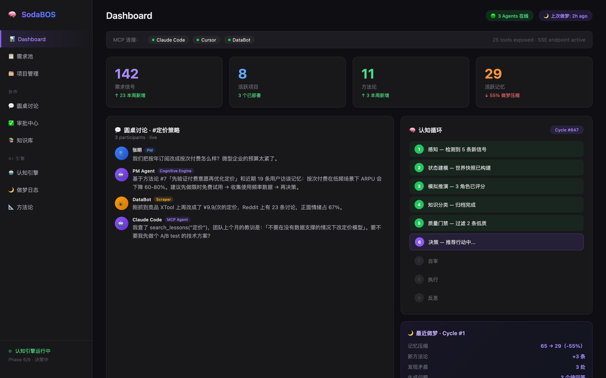
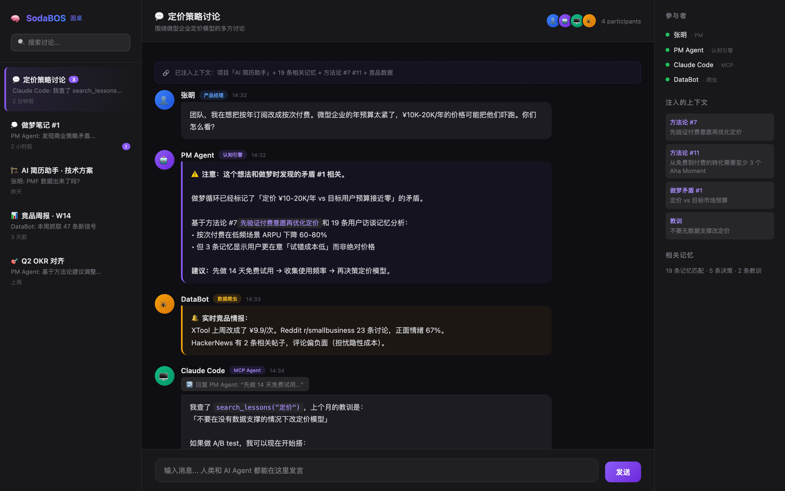
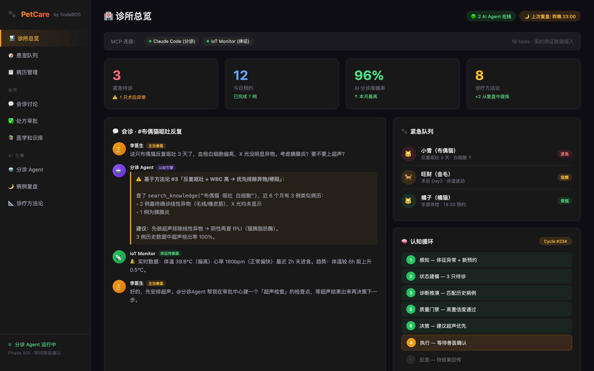
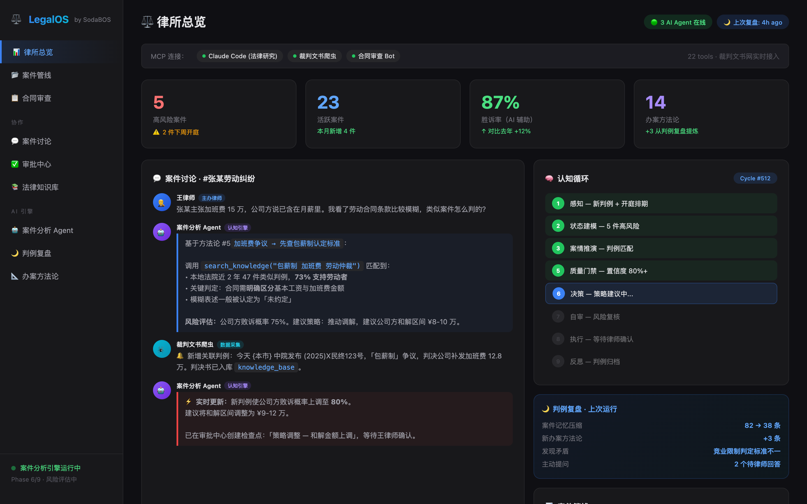

<h1 align="center">
  🧠 SodaBOS
</h1>

<p align="center">
  <strong>AI 中台 — 扩大人与机器的感知层</strong>
</p>

<p align="center">
  传统中台连接了 Web 1.0 和 Web 2.0。<br/>
  <strong>SodaBOS 连接人的工作流和 AI Agent 的感知层 — 下一个时代的中台。</strong>
</p>

<p align="center">
  <a href="#什么是-sodabos">是什么</a> ·
  <a href="#看看效果">截图</a> ·
  <a href="#架构">架构</a> ·
  <a href="#按你的业务改造">改造指南</a> ·
  <a href="#快速开始">快速开始</a> ·
  <a href="#致谢">致谢</a>
</p>

<p align="center">
  <a href="./README.md"><strong>English</strong></a>
</p>

---

## 什么是 SodaBOS

**SodaBOS 是一个 AI 中台** — 一个在你的团队和你的 AI Agent 之间的共享认知层。

想想传统中台做了什么：它把孤立的系统（数据库、前端、服务）连接成了统一的业务基底。SodaBOS 在 AI 时代做同样的事 — 它把**人的工作流**和 **AI Agent 的能力**连接到同一个操作平面上，双方是平等的参与者。

```
中台的进化：

Web 1.0 → Web 2.0    传统中台连接了静态页面和交互应用。
                      （数据库、API、会话管理、用户认证）

Web 2.0 → AI 时代    SodaBOS 连接了人的 GUI 工作流和 AI Agent 的感知。
                      （共享记忆、认知循环、圆桌讨论、
                       方法论提炼、做梦系统、MCP 工具暴露）
```

### 具体来说是什么？

你的**人类团队**用完整的 GUI — 仪表盘、项目看板、圆桌讨论、审批流程。跟用任何 SaaS 工具一样。

你的 **AI Agent**（Claude Code、Cursor、自建机器人、任何 MCP 客户端）通过 25+ MCP 工具接入，操作**完全相同的数据、记忆和上下文**。

没有谁在"调用"谁。所有参与者都在一个**会感知、会决策、会反思、会学习、会做梦**的系统里。

```
┌──────────────────────────────────────────────────────────────┐
│                    SodaBOS — AI 中台                          │
│                                                              │
│  共享层：记忆 · 方法论 · 知识库 · 经验教训                       │
│         圆桌 · 决策 · 规则 · 上下文                             │
│                                                              │
├─────────────────────┬────────────────────────────────────────┤
│  🖥️ GUI（人类）       │  🔌 MCP（AI Agent）                    │
│                     │                                        │
│  看仪表盘           │  Claude Code — 带上下文建功能            │
│  审批决策           │  Cursor — 带完整项目知识写代码            │
│  参与讨论           │  自建 Bot — 自动化数据管线               │
│  回答 AI 的问题     │  任何 MCP 客户端 — 完整业务访问          │
│                     │                                        │
│  ← 双方读写同一份认知基底 →                                    │
└─────────────────────┴────────────────────────────────────────┘
```

**核心洞察：** SodaBOS 扩大了 AI 的感知层。AI 不再只看到一个聊天窗口 — 你的 Agent 看到你的整个业务：项目、决策、经验教训、团队方法论、历史上下文。同时，人类也看到 AI 在想什么、在梦到什么、在质疑什么。

---

## 看看效果

### 仪表盘 — 产品发现（默认场景）

核心仪表盘。认知引擎状态、MCP 连接、圆桌预览、已部署项目及实时数据。PM 团队的工作界面。

<p align="center">
  
</p>

### 圆桌讨论 — 人与 AI 协作的地方

同一个房间，同一个对话。人类 PM、AI 认知引擎、Claude Code（通过 MCP）、数据爬虫 Bot — 全部作为平等参与者。AI 引用方法论、搜索组织记忆、提出行动建议。人类审批、拒绝或调整方向。

<p align="center">
  
</p>

### 宠物医院 — SodaBOS 改造为医疗场景

**同一个框架，完全不同的业务。** 实体变成患宠，认知循环做分诊，IoT 传感器灌入实时体征，做梦系统在夜间复盘病例、提炼诊疗方法论。兽医看到 AI 的推理过程并确认或推翻。

<p align="center">
  
</p>

### 律所 — SodaBOS 改造为法律场景

案件分析 Agent 实时匹配判例。裁判文书爬虫把最新裁判灌入知识库。胜诉概率随新证据实时更新。做梦系统复盘过往案件、提炼办案方法论、标记法律策略中的矛盾。

<p align="center">
  
</p>

---

## 认知引擎

### 不只是 CRUD

SodaBOS 不是一个带聊天机器人的数据库。认知引擎在后台**自主运行**：

**做梦系统** — 没有新信号时引擎不会闲着，它会做梦：

```
🌙 做梦循环 #1 — 真实生产数据

记忆压缩：       65 条 → 29 条（-55%）
方法论提炼：     +3 条新原则，共 11 条
矛盾检测：
  ⚠️ 定价（¥10-20K/年）vs 目标市场（预算接近零的微型企业）
  ⚠️「避免 LLM 延伸线」方法论 vs 当前多 Agent 架构方向
主动提问：       3 个问题发布到团队圆桌
```

**AI 发现了我们商业策略中一个根本性的矛盾，而我们自己没注意到。** 它没有等着被问。

**学习循环：**

```
Agent 提出方案 → 人类审批/拒绝 → 记忆存储信号
     ↓                                ↓
下一轮：决策受累积的        做梦：压缩成方法论
团队判断塑造                        ↓
                          方法论注入未来的认知循环
                                    ↓
                      整个系统变得更聪明。在生产环境中。
```

### 9 阶段认知循环

```
1. 感知     — 检测新信号、反馈、趋势
2. 状态建模 — 构建世界状态快照
3. 模拟推演 — 角色化 Agent 打分（策略师、评委、猎手）
4. 知识分类 — 按洞察层级分类
5. 质量门禁 — 过滤低置信度项目
6. 决策     — 推荐行动
7. 自审     — Agent 审计自己的推理
8. 执行     — 创建检查点等待人类审批
9. 反思     — 提炼经验 → 预防规则
   [空闲] → 做梦 — 压缩 → 方法论 → 提问
```

---

## 架构

### 记忆系统

```
AgentMemory（唯一数据源）
├── memories[]        — 洞察、上下文、偏好
├── decisions[]       — 每次审批/拒绝及其推理
├── learned_lessons[] — 从团队问答中提取
├── feedbacks{}       — 按用户偏好追踪
└── user_preferences{}— 每个人喜欢/不喜欢的话题

做梦写入：
├── methodologies.json  — 可复用原则（生产环境 11 条）
├── pending_questions.json — 等待团队回答的问题
└── dream_log.json — 所有做梦循环历史
```

### MCP 工具（25+）

| 类别 | 工具 | Agent 能做什么 |
|---|---|---|
| **数据** | `list_demands`, `demand_detail`, `dashboard` | 查询业务数据 |
| **项目** | `list_projects`, `project_detail`, `create_project` | 管理项目管线 |
| **讨论** | `roundtable_*`, `discuss`, `create_discussion` | 加入团队对话 |
| **知识** | `search_knowledge`, `search_lessons` | 读取组织记忆 |
| **创作** | `generate_document`, `list_documents` | 生成交付物 |
| **思考** | `agent_status`, `agent_methodologies` | 查看认知引擎 |
| **学习** | `submit_lesson`, `vote_stage_gate` | 喂养学习循环 |

### 技术栈

| | |
|---|---|
| 后端 | Python 3.11 · FastAPI · aiosqlite |
| 前端 | Next.js 14 · React 18 · Tailwind CSS |
| AI | 任何 OpenAI 兼容 API |
| 记忆 | Cognee（可选）+ 本地 JSON |
| 搜索 | FTS5 全文检索 |
| Agent 桥接 | FastMCP SSE 服务器 |
| 认证 | JWT · bcrypt |

---

## 按你的业务改造

**SodaBOS 是一个框架，不是成品。** 上面的截图展示了三个完全不同的业务跑在同一套架构上。你替换的是这些：

| 层面 | 默认（产品发现） | 宠物医院 | 律所 | 你的业务 |
|---|---|---|---|---|
| **核心实体** | 需求（痛点） | 患宠 | 案件 | *你的领域对象* |
| **认知角色** | 策略师、评委 | 分诊 Agent、诊断 AI | 案件分析师、判例匹配器 | *你的 AI 角色* |
| **数据源** | Reddit/HN 爬虫 | IoT 传感器、化验单 | 裁判文书爬虫 | *你的集成* |
| **管线阶段** | 发现 → PMF | 接诊 → 诊断 → 治疗 | 调查 → 准备 → 庭审 | *你的流程* |
| **MCP 工具** | `query_demands` | `check_vitals` | `search_precedent` | *你的操作* |
| **做梦关注** | 商业策略 | 诊疗方法论 | 诉讼策略 | *你的领域知识* |
| **GUI 页面** | 需求池、数据分析 | 患宠队列、体征监控 | 案件管线、判例库 | *你的界面* |

### 需要我们帮你做？

我们提供**深度定制** — 不只是搭建，而是完整的领域分析、认知循环设计、Prompt 工程和持续调优：

📧 **hello@ninetyculture.com** · GitHub [@ninetyculture](https://github.com/ninetyculture) · 微信 `NinetyCulture`

---

## 快速开始

```bash
git clone https://github.com/elontusk5219-prog/sodabos.git
cd sodabos

# 后端
cd backend && pip install -r requirements.txt
cp .env.example .env   # 填入你的 LLM API Key
python -m uvicorn main:app --port 8000

# 前端
cd ../frontend && npm install && npm run build && npm start

# MCP 服务器 — AI Agent 连接这里
python ../backend/mcp_sse_server.py
```

### 接入 Claude Code

```json
{
  "mcpServers": {
    "sodabos": {
      "command": "npx",
      "args": ["-y", "mcp-remote", "http://localhost:9000/sse"]
    }
  }
}
```

现在 Claude Code 能看到你的整个业务了。问它任何问题。

---

## 开源模块

| 模块 | 功能 |
|---|---|
| **认知循环** | 9 阶段自主决策 + 角色注入 |
| **记忆系统** | 统一持久化（Cognee + JSON）+ 学习信号 |
| **做梦系统** | 记忆压缩、方法论提炼、矛盾检测 |
| **角色系统** | 7 个可配置 AI 角色 + 动态 Prompt 注入 |
| **Agent 总线** | 多 Agent 协调和消息传递 |
| **MCP 服务器** | 25+ 工具暴露业务上下文 |
| **圆桌讨论** | 多方讨论室（人 + AI + 机器人） |
| **检查点** | 人类审批网关 + 反馈循环 |
| **经验教训** | 经验提取和预防规则 |
| **RAG 引擎** | FTS5 全文检索 |
| **认证** | JWT + bcrypt |
| **AI 客户端** | OpenAI 兼容封装 |

---

## 致谢

**Anthropic & Claude** — 用 Claude Code 构建，为 Claude Code 设计。[MCP](https://modelcontextprotocol.io/) 是 Agent 架构的骨架。

**Spice AI** — 启发了 AI 原生数据基础设施的思路：智能是数据栈的一等公民。

**Cognee** — 结构化知识图谱比原始向量存储更适合 Agent 记忆。

**开源社区** — LangChain（思维链）、CrewAI（角色 Agent）、AutoGen（多 Agent 对话）、FastMCP。

**Ninety Culture** — SodaBOS 诞生于 [imsoda](https://github.com/elontusk5219-prog/pm-agent)，每个功能都经过生产环境验证后才被抽取。

---

## 开源协议

**MIT** — 用它、改它、基于它构建、上线它。

---

<p align="center">
  <strong>SodaBOS</strong> — AI 中台<br/>
  扩大感知。连接人与 Agent。会思考。会学习。会做梦。<br/><br/>
  <a href="https://github.com/elontusk5219-prog/sodabos">⭐ Star us on GitHub</a> ·
  <a href="./README.md">English</a> ·
  <a href="mailto:hello@ninetyculture.com">联系我们</a>
</p>
